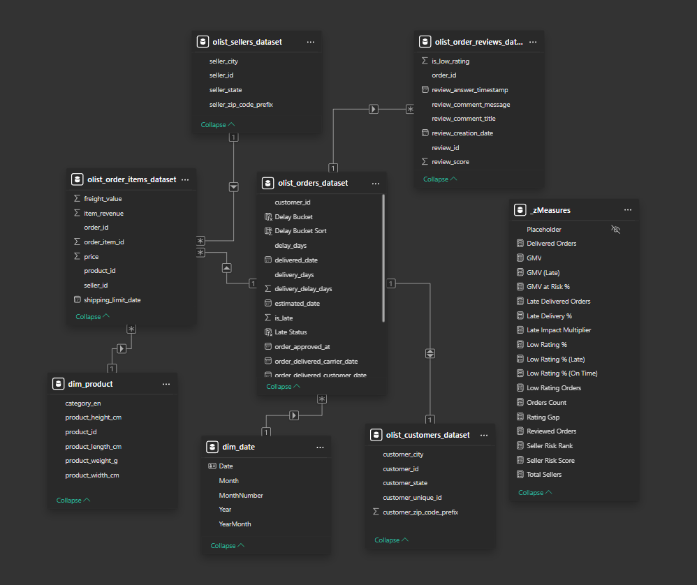
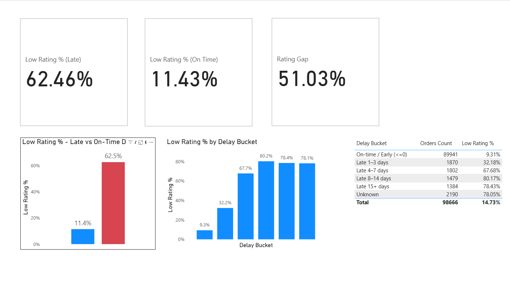
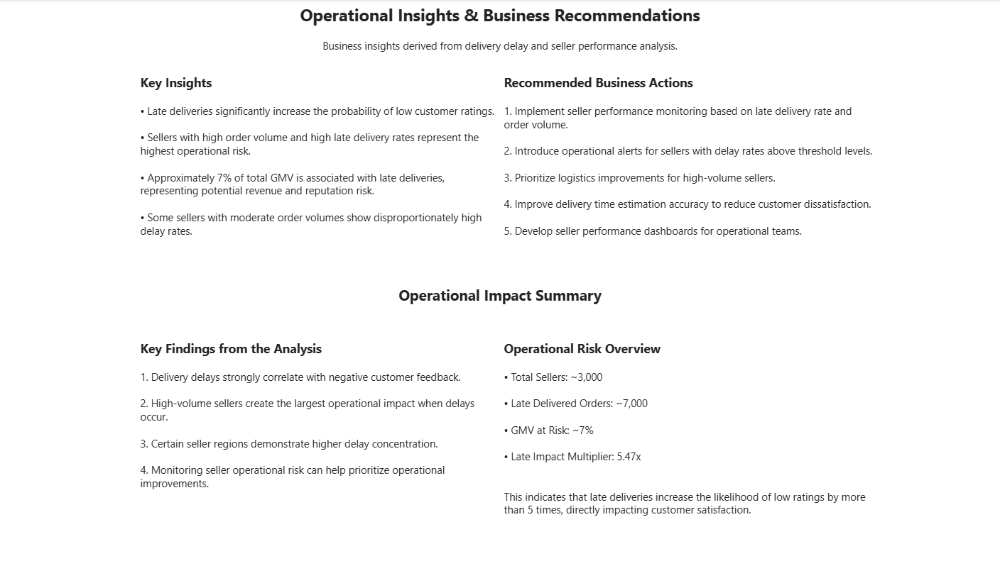

# 📦 E-commerce Delivery Delay Impact Analysis
Power BI | Data Modeling | Customer Analytics | Operational Insights

## 📌 Project Overview
This project analyzes the operational impact of delivery delays on customer satisfaction using the Brazilian Olist e-commerce dataset.
The objective was not just to build dashboards, but to quantify how delivery performance affects customer ratings and revenue risk.

## 🎯 Business Problem
Does late delivery significantly increase the probability of low customer ratings?

If so:
- Which sellers drive the highest operational risk?
- Which regions show structural delay patterns?
- How much revenue is associated with delayed deliveries?
- What actions can reduce customer dissatisfaction?

## 📊 Key KPI Results
| Metric                 | Value        |
| ---------------------- | ------------ |
| Total Orders           | 99,441       |
| Late Orders            | 6,535 (6.6%) |
| Low Rating % (On-Time) | 11.43%       |
| Low Rating % (Late)    | 62.46%       |
| Rating Gap             | +51.03 p.p.  |

📌 Late delivery increases the probability of receiving a low rating by more than 5x.
This confirms that delivery reliability is the strongest driver of negative customer feedback.

## 🗂 Dataset
Source: Brazilian E-commerce Public Dataset (Olist)

Tables used:
- Orders
- Order Items
- Reviews
- Customers
- Sellers
- Products
- Category Translation
The dataset includes:
- 100k+ orders
- Delivery timestamps
- Customer reviews (1–5 score)
- Seller-level operational data

## 🏗 Data Model
A proper star schema was implemented:

Fact Tables:
- fact_orders
- fact_order_items
- fact_reviews

Dimension Tables:
- dim_customer
- dim_seller
- dim_product
- dim_date

Power Query ransformations:
- Delivery delay calculation
- Late / On-Time flag creation
- Date normalization
- Revenue calculations

## 📷 Star Schema Model


## 📊 Dashboard Overview
### 1️⃣ Executive Overview
High-level KPIs showing operational performance and rating impact.


### 2️⃣ Delay → Rating Impact
Visual comparison between On-Time vs Late low rating probability.


### 3️⃣ Seller & Region Risk Analysis
Identification of high-risk sellers and geographic delay clusters.


### 4️⃣ Insights & Recommendations
Business-focused operational actions derived from data.


## 🧠 Analytical Techniques Used
- Star schema modeling
- DAX context-based KPI calculations
- Segmented analysis (Late vs On-Time)
- Revenue at risk calculation
- Delay severity bucket segmentation
- Decomposition Tree for driver analysis
- Drillthrough seller-level investigation

## 🔎 Core Insights
### 1️⃣ Late deliveries sdrive negative feedback
Late deliveries increase low rating probability from 11.43% to 62.46%.

### 2️⃣ Operational risk is concentrated
small number of sellers contribute disproportionately to delay volume.

### 3️⃣ Revenue at Risk is measurable
elayed orders represent a significant share of delivered GMV.

### 4️⃣ Structural regional patterns exist
Certain states show consistently higher late delivery percentages.

## 🚀 Business Recommendations
- Introduce seller-level SLA monitoring.
- Flag high-risk sellers using delay thresholds.
- Improve logistics in high-delay regions.
- Implement early delay detection alerts.
- Use delay risk scoring to prevent rating drops.

## 🛠 Tools Used
- Power BI
- Power Query
- DAX
- Star Schema Modeling
- KPI & Driver Analysis

## 📎 Repository Structure
```
PowerBI/
    Ecommerce_Customer_Experience.pbix

Docs/
    model_view.png
    overview.png
    delay_analysis.png
    seller_analysis.png
    insights.png

DAX/
    Measures.md

README.md
```

## 💡 What This Project Demonstrates
- [x] Business-first analytical thinking
- [x] Proper star schema modeling
- [x] Strong DAX KPI development
- [x] Operational impact quantification
- [x] ctionable data-driven recommendations

## Key Findings
- Even 1–3 day delays triple the probability of low customer ratings.
- Severe delays (8+ days) push dissatisfaction above 75–80%.
- Late deliveries represent a significant share of at-risk GMV.
- Operational delay control directly impacts customer satisfaction and revenue protection.

🔙 [Back to Portfolio](https://github.com/BlladeRunner)